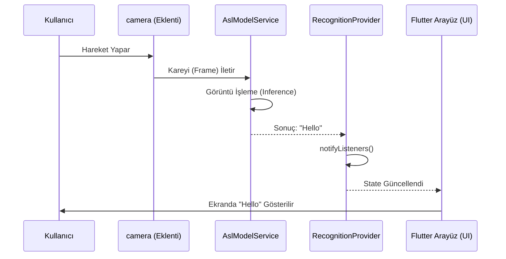

# 01 - Proje Mimarisi

## Amaç
Bu belgenin amacı, ASL İşaret Dili Uygulamasının donanım ve yazılım bileşenlerinin (Kamera, ML Modeli, Ses, Video) birbirleriyle nasıl etkileşime girdiğini ve sistemin genel veri akışını açıklamaktır.

## İçindekiler
1. Genel Mimari (Overall Architecture)
2. İstemci-Sunucu İletişimi
3. Çevrimdışı Öncelikli Felsefe (Offline-first Philosophy)
4. Ölçeklenebilirlik (Scalability)
5. Örnek Akış Şemaları
6. AI Implementation Notes

---

## Genel Mimari (Overall Architecture)
Uygulama, "Akıllı İstemci (Smart Client)" yaklaşımını benimser. Makine Öğrenmesi (ML) algılamaları ve veri önbellekleme gibi karar mekanizmaları doğrudan cihaz üzerinde (Edge) çalışır.

### Temel Bileşenler:
1. **Presentation Layer (Kullanıcı Arayüzü):** `screens/` klasöründeki Flutter widget'ları (Kamera ekranı, Sözlük ekranı, Arama çubuğu).
2. **State Management (Durum Yönetimi):** `providers/` klasörü (`DictionaryProvider`, `RecognitionProvider`, `SettingsProvider`). Uygulamanın o anki durumunu ekranlara dağıtır.
3. **Services (İş Mantığı ve Donanım API'leri):**
   * `asl_model_service.dart`: Kamera görüntülerini TFLite/ML modeline yollayıp sonuç alan servis.
   * `stt_service.dart` & `tts_service.dart`: Cihazın yerel ses-metin donanımlarına erişen servisler.
4. **Local Storage (Yerel Depolama - Planlanan):** 
   * Gelecekte SQLite (Kelimeler) ve Cache Manager (Videolar) entegre edilecektir.
5. **Cloud Infrastructure (Bulut - Planlanan):**
   * Cloudflare R2: Eğitim videolarının barındırılacağı yer.

## İstemci-Sunucu İletişimi
Bu projede şimdilik geleneksel bir Backend Sunucusu YOKTUR.
* ML Modeli doğrudan telefonun işlemcisinde (NPU/CPU) çalışır.
* Ses-Metin dönüşümleri cihazın yerel kütüphanelerini (`speech_to_text`) kullanır.
* Gelecekte eklenecek Sözlük videoları, doğrudan Cloudflare R2'dan cihazın önbelleğine (`cache_manager`) indirilecektir.

## Çevrimdışı Öncelikli Felsefe (Offline-first Philosophy)
Kamera tanıma sistemi (ML) tamamen çevrimdışı çalışacak şekilde kurgulanmıştır. Kullanıcı metrodayken veya interneti yokken de kamerasını açıp ASL hareketlerini metne dökebilir. Sözlük tarafında ise bir video bir kez izlendikten sonra cihaza kaydedilir ve bir sonraki aramada internet gerektirmez.

---

## Örnek Akış Şemaları

### Kamera ML Algılama Akışı

---

## AI IMPLEMENTATION NOTES
* Architecture Paradigm: Serverless, Offline-First, Edge AI (Smart Client).
* State flows strictly through `Provider` classes via `notifyListeners()`.
* Services (`services/`) are independent business logic layers injected into or called by Providers.
* UI (`screens/`) only reads/listens to Providers, it does not directly process camera frames or ML logic.
