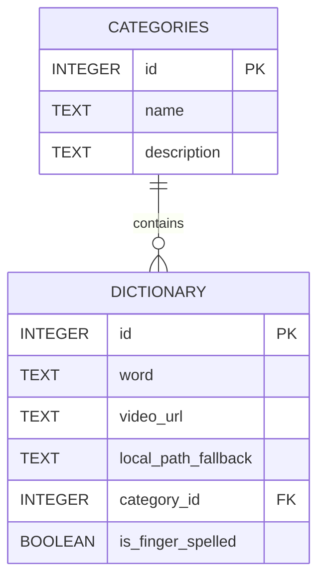

# 06 - SQLite Veritabanı Tasarımı ve Sözlük Mimarisi

## Amaç
Flutter uygulamasının içindeki ASL Sözlüğünü ve metinden işaret diline (Text-to-ASL) dönüşüm haritasını yönetmek için yerel bir SQLite veritabanı kullanılır. Bu belge, veritabanı tasarımını (şemasını), indekslemeyi ve arama performansını nasıl artıracağımızı açıklar.

## İçindekiler
1. Neden SQLite (Çevrimdışı Depolama)
2. Veritabanı Tasarımı (Schema) ve Normalizasyon
3. Örnek ER Diyagramı
4. Tablolar ve Veri Türleri
5. Arama Optimizasyonu ve İndeksler (Indexes)
6. Versiyonlama ve Veritabanı Göçü (Migration)
7. Özet
8. AI Implementation Notes

---

## 1. Neden SQLite (Çevrimdışı Depolama)
Eğer 1.000 kelimenin bilgisini bir JSON veya Dart listesi (`List<String>`) içinde tutsaydık, her kelime aramasında uygulama tüm listeyi hafızaya almak (RAM tüketimi) ve yavaş bir döngüde dönmek zorunda kalırdı. 
SQLite, diske yazılı bir ilişkisel veritabanı motorudur. RAM'i şişirmez, indeksleme (B-Tree) sayesinde milyonlarca kelime arasından isteneni 1 milisaniyenin altında bulur. İnternet gerektirmediği için Offline-first yapının kalbidir.

---

## 2. Veritabanı Tasarımı (Schema) ve Normalizasyon
Bu proje için basit ama genişletilebilir (denormalize edilmemiş, gereksiz tekrardan kaçınılmış) bir tablo yapısı önerilmektedir. Temel olarak iki tablo oluşturulabilir:
1. `dictionary`: Kelimelerin ve videoların barındığı ana tablo.
2. `categories` (Opsiyonel): "Selamlaşma", "Renkler", "Hayvanlar" gibi ASL sözlük kategorileri.

---

## 3. Örnek ER Diyagramı (Mermaid)



---

## 4. Tablolar ve Veri Türleri

### A. Dictionary Tablosu
Uygulamanın ASL çeviri yaparken (Text-to-ASL) sorguladığı ana tablodur.

| Sütun Adı | Tür (Type) | Özellikler | Açıklama |
| :--- | :--- | :--- | :--- |
| `id` | INTEGER | PRIMARY KEY, AUTOINCREMENT | Benzersiz kayıt numarası |
| `word` | TEXT | NOT NULL, UNIQUE | Sözcük (Örn: "hello", "apple") |
| `video_url` | TEXT | NOT NULL | Cloudflare R2'daki public link |
| `category_id`| INTEGER | NULLABLE, FOREIGN KEY | Kategorize edilmiş sayfalar için |
| `is_finger_spelled`| BOOLEAN | DEFAULT 0 (False) | Özel isimse harf harf kodlama mı? |

### B. Categories Tablosu (Opsiyonel Genişletme)
Kullanıcı "Alfabe" kategorisine veya "Aylar" kategorisine tıklayıp kelimeleri liste halinde görmek isterse kullanılır.

---

## 5. Arama Optimizasyonu ve İndeksler (Indexes)
Text-to-ASL sırasında, uzun bir cümlenin her kelimesi saniyenin onda biri hızında sorgulanmalıdır. Arama işlemleri genelde `word` sütunu üzerinden `SELECT * FROM dictionary WHERE word = 'hello'` şeklinde yapılacaktır.
Bu aramanın anında gerçekleşmesi için `word` sütununa **INDEX** oluşturulması şarttır.

**SQL Komutu:**
```sql
CREATE INDEX idx_dictionary_word ON dictionary(word);
```
Bu indeks sayesinde veritabanı tüm satırları tek tek aramak (Full Table Scan) yerine, bir ağaç yapısında doğrudan kelimeyi bulur.

---

## 6. Versiyonlama ve Veritabanı Göçü (Migration)
* **Pre-populated DB:** Veritabanı cihazda sıfırdan oluşturulmaz. Geliştirici içi dolu bir `asl_dict.db` dosyasını `assets/models/` klasörüne gömer. Uygulama ilk açıldığında `sqflite` bu dosyayı `assets` içinden okur ve telefonun kalıcı diskine kopyalar.
* **Migration (Güncelleme):** İleride yeni kelimeler eklediğinizde veritabanı versiyonu güncellenir. Uygulama GitHub Releases üzerinden veya uygulamanın yeni bir güncellemesiyle yeni `.db` dosyasını eskisinin üstüne yazar veya `ALTER TABLE` / `INSERT` işlemleriyle veritabanını günceller.

---

## Özet
Veritabanı yapısı temiz ve küçük tutulmalıdır. SQLite tablolarına videoların kendisi (BLOB olarak) **asla** eklenmez. Yalnızca kelimeler ve bu kelimelerin videolarının Cloudflare R2 üzerindeki linkleri (`video_url`) saklanır. `word` sütununa eklenecek bir INDEX ile yüksek hız garanti altına alınır.

---

## AI IMPLEMENTATION NOTES
* NEVER store binary files (images/videos) as BLOBs in the SQLite database. Store URL strings only.
* Use `sqflite` package in Flutter.
* Implement a pre-populated database pattern: Use `rootBundle.load` to copy the initial `.db` file from `assets` to `getDatabasesPath()` during the app's first launch.
* Always enforce uniqueness and indices: `CREATE UNIQUE INDEX idx_word ON dictionary(word COLLATE NOCASE);` (NOCASE ensures case-insensitive fast lookups).
* Text-to-ASL mapping requires exact string matching. Normalize input strings (lowercase, trim) before executing the SQLite query.
