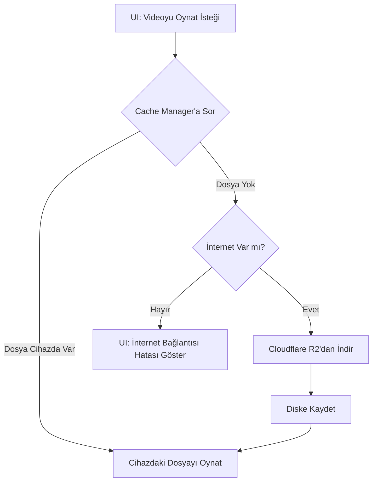

# 08 - Önbellek (Cache) Sistemi ve Offline Oynatma

## Amaç
Bu belgenin amacı, ASL videolarının cihazda nasıl yönetildiğini açıklamaktır. Cloudflare R2'dan indirilen dosyaların her seferinde internet tüketmemesi ve uygulamanın metro veya hastane gibi internetsiz ortamlarda çalışmaya devam edebilmesi (Offline-first) için kurulan Caching (Önbellekleme) mekanizması anlatılacaktır.

## İçindekiler
1. Önbellekleme (Caching) Nedir?
2. Memory Cache vs. Disk Cache
3. Neden `flutter_cache_manager`?
4. Download Flow (İndirme Akışı)
5. Çevrimdışı (Offline) Oynatma
6. Süre Sonu (Expiration) ve Geçersiz Kılma (Invalidation)
7. Depolama Temizliği (Storage Cleanup)
8. Özet
9. AI Implementation Notes

---

## 1. Önbellekleme (Caching) Nedir?
Cache, sık kullanılan verilerin veya dosyaların geçici olarak cihazda saklanarak daha hızlı (ve internetsiz) erişilmesini sağlayan bir hafıza sistemidir.
Örneğin bir kullanıcı ASL uygulamasında "Teşekkürler" (`thank_you.mp4`) kelimesine bakarsa video Cloudflare R2'dan cihazın hafızasına indirilir. Kullanıcı aynı kelimeye 1 saat sonra tekrar baktığında, internete hiç bağlanılmaz ve video anında cihaz hafızasından açılır.

---

## 2. Memory Cache vs. Disk Cache
* **Memory Cache (RAM):** Dosyayı cihazın geçici belleğinde (RAM) tutar. Hızlıdır ama uygulama kapanınca tüm dosyalar silinir. Video dosyaları büyük olduğu için RAM'de tutulması uygulamanın çökmesine sebep olur.
* **Disk Cache (Storage):** Dosyayı cihazın fiziksel depolama biriminde (SSD/Hafıza Kartı) tutar. Uygulama kapansa veya cihaz yeniden başlasa bile videolar güvendedir.
Bu projede Disk Cache kullanılacaktır.

---

## 3. Neden `flutter_cache_manager`?
Bu paket, manuel olarak dosya indirme, klasör oluşturma ve eski dosyaları silme dertlerini ortadan kaldırır. 
* URL verirsiniz, o size yerel dosya yolu (File path) verir.
* Kendisi arka planda dosya daha önce inmiş mi diye kontrol eder.
* Hafıza dolduğunda (örneğin 500 MB'a ulaşınca) otomatik olarak **en eski indirilen videoları** kendi kendine silerek (LRU Cache) telefonu korur.

---

## 4. Download Flow (İndirme Akışı)

---

## 5. Çevrimdışı (Offline) Oynatma
`video_player` paketi doğrudan bir HTTP URL'si alarak çalışabilir ancak bu işlem her seferinde internet kullanır. Offline oynatma için şu yöntem uygulanır:
1. `flutter_cache_manager`'ın `getFileStream(url)` fonksiyonu dinlenir.
2. İnme tamamlandığında, Manager size `java.io.File` / `dart:io File` sınıfından bir obje döndürür (`/data/user/0/com.app/cache/thank_you.mp4`).
3. VideoPlayer, `VideoPlayerController.file(file)` metodu kullanılarak başlatılır (Böylece Player, internet URL'si değil yerel diskteki dosyayı çalar).

---

## 6. Süre Sonu (Expiration) ve Geçersiz Kılma (Invalidation)
Bazen R2 üzerindeki bir video güncellenmiş olabilir. Ancak cihazdaki cache ömrü dolmadan eski video görünmeye devam eder. 
* `flutter_cache_manager` varsayılan olarak bir dosyayı **30 gün** boyunca saklar (Stale period).
* **Invalidation:** Eğer acil bir güncelleme (video değişimi) yaptıysanız, veritabanındaki URL'ye bir versiyon parametresi ekleyerek cihazın eski cache'i pas geçip yenisini indirmesini sağlayabilirsiniz. Örn: `thank_you.mp4?v=2`

---

## 7. Depolama Temizliği (Storage Cleanup)
Uygulamanın `Settings` (Ayarlar) ekranına mutlaka "Önbelleği Temizle (Clear Cache)" butonu konulmalıdır. Bu sayede kullanıcı, telefonu dolduğunda uygulamayı silmek yerine `DefaultCacheManager().emptyCache()` komutunu çağırarak indirilen tüm videoları temizleyebilir.

---

## Özet
Cloudflare R2 bant genişliğinden (Maliyetten) kurtarırken, `flutter_cache_manager` kullanıcıyı internet bağımlılığından ve yavaş video yüklenme sürelerinden kurtarır. İkisi kusursuz bir uyum içinde çalışarak "Offline-first" hedefimizi gerçekleştirir.

---

## AI IMPLEMENTATION NOTES
* Do not initialize `VideoPlayerController.network(url)` directly for playing dictionary words. 
* Use `DefaultCacheManager().getSingleFile(url)` to retrieve the `File` object, then use `VideoPlayerController.file(file)`.
* Wrap the UI with a FutureBuilder or Riverpod AsyncValue to show a `CircularProgressIndicator` while the file is downloading to cache.
* Ensure a button exists in the app settings triggering `DefaultCacheManager().emptyCache()` to free storage.
